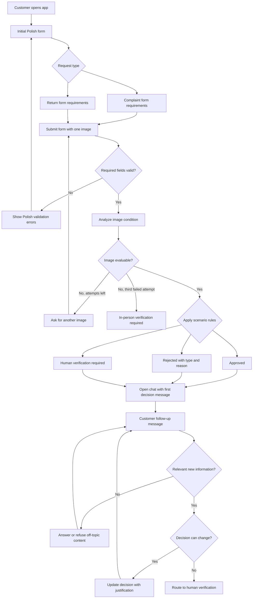

# PRD - Best Service Decision

---

## 1. Executive Summary

Best Service Decision is an MVP for final customers who want to submit an electronics complaint or return request. The product starts with a structured form, analyzes one uploaded equipment photo, and then opens a Polish chat interface where the system presents a final decision with justification and next steps.

The MVP must support two request types: complaint and return. The system decision is treated as the system's final decision, but customers may challenge it, in which case the case is routed to human verification.

---

## 2. Problem Statement

Customers submitting electronics complaints or returns often provide incomplete, inconsistent, or low-quality information. Support teams must manually inspect photos, interpret descriptions, apply complaint and return rules, and explain decisions in a consistent way.

This creates slow handling, inconsistent decisions, and repeated back-and-forth when the customer does not understand what information is required. The MVP reduces the first-line decision workload by collecting structured data, interpreting the equipment condition from a photo, applying strict business rules, and allowing the customer to continue the conversation when clarification is needed.

---

## 3. Users / Personas

### Final Customer With a Defective Product

A customer who believes their electronics equipment is defective and wants a complaint decision. They expect a clear answer, a reason for the decision, and practical next steps.

### Final Customer Returning a Product

A customer who wants to return recently purchased electronics. They expect confirmation whether the product appears eligible for return and whether it can be resold.

### Final Customer With Incomplete or Ambiguous Evidence

A customer who uploads a poor-quality photo, provides a vague description, or gives information that conflicts with the photo. They expect the system to explain what is missing and how to continue.

---

## 4. Main Flows

### 4.1 Complaint Happy Path

1. The customer opens the application.
2. The system displays the initial request form in Polish.
3. The customer selects "Reklamacja".
4. The customer selects an electronics category.
5. The customer enters the equipment name or model.
6. The customer selects the purchase date.
7. The customer enters a complaint reason.
8. The customer uploads one image showing the equipment condition or defect.
9. The system validates that all complaint-required fields are present.
10. The system analyzes the image to describe visible condition, damage, signs of misuse, and possible cause indicators.
11. The system applies the complaint rules to the form data and image analysis.
12. The system opens the chat interface.
13. The first system chat message greets the customer, states the decision, gives a clear justification, and explains next steps.
14. The customer may ask questions or provide additional information in chat.
15. If new information materially changes the case, the system may update the decision and explain what changed.

### 4.2 Return Happy Path

1. The customer opens the application.
2. The system displays the initial request form in Polish.
3. The customer selects "Zwrot".
4. The customer selects an electronics category.
5. The customer enters the equipment name or model.
6. The customer selects the purchase date.
7. The customer may enter a return reason.
8. The customer uploads one image showing the equipment condition.
9. The system validates that all return-required fields are present.
10. The system analyzes the image to describe visible usage, damage, missing parts, labels, packaging indicators if visible, and resale condition.
11. The system applies the return rules to the form data and image analysis.
12. The system opens the chat interface.
13. The first system chat message greets the customer, states the decision, gives a clear justification, and explains next steps.
14. The customer may ask questions or provide additional information in chat.
15. If new information materially changes the case, the system may update the decision and explain what changed.

### 4.3 Unclear Image Flow

1. The customer submits the form with an unclear, too dark, blurred, incomplete, irrelevant, or contradictory image.
2. The system does not issue an approval or rejection based only on the unclear image.
3. The system asks the customer to upload another image and explains what must be visible.
4. The customer may retry image upload up to three total attempts.
5. After the third failed image attempt, the system informs the customer that the case requires in-person service verification.

### 4.4 Customer Disagrees With Decision

1. The system presents an approved or rejected decision in chat.
2. The customer disagrees, challenges the decision, or provides additional facts.
3. The system reviews the new customer message against the original form data, image description, conversation history, and strict rules.
4. If the new information is sufficient and relevant, the system may change the decision and explain why.
5. If the disagreement cannot be resolved automatically, the system informs the customer that the case will be verified by a human employee.

### 4.5 Edge Case Handling

1. The customer submits offensive, unrelated, nonsensical, or manipulation-oriented content.
2. The system refuses to process unrelated or abusive parts of the message.
3. The system keeps the conversation focused on the complaint or return case.
4. If the case cannot be evaluated due to customer behavior or missing evidence, the system routes the case to human verification or in-person verification.

---

## 5. User Stories

1. As a customer, I want to submit a complaint with product details, reason, purchase date, and photo, so that I can receive a decision without contacting support first.
2. As a customer, I want to submit a return request with product details, purchase date, and photo, so that I can know whether the product appears returnable.
3. As a customer, I want the first chat response to clearly explain the decision and next steps, so that I understand what will happen next.
4. As a customer, I want to ask follow-up questions in chat, so that I can understand or challenge the decision.
5. As a customer, I want to provide additional information after the first decision, so that the system can reconsider the case when relevant facts were missing.
6. As a customer, I want the system to tell me when my photo is insufficient, so that I know what kind of photo to upload next.
7. As a customer, I want human verification when the system cannot resolve my case, so that the request is not blocked by automation.

---

## 6. Acceptance Criteria

### Form

AC-01: The form displays exactly two request type options: "Reklamacja" and "Zwrot".

AC-02: The equipment category field is a predefined selection list containing at least: laptop, desktop PC, smartphone, tablet, monitor, TV, printer, headphones, smartwatch, gaming console, computer accessory, and other electronics.

AC-03: The equipment name or model field is required for both complaint and return requests.

AC-04: The purchase date field is required for both complaint and return requests.

AC-05: The complaint or return reason field is required when the selected request type is "Reklamacja".

AC-06: The complaint or return reason field is optional when the selected request type is "Zwrot".

AC-07: The customer must upload exactly one image before submitting the form.

AC-08: The system blocks submission and displays a Polish validation message when a required field is missing.

### Image Analysis

AC-09: For complaint requests, the system generates an image condition description covering visible damage, visible defect indicators, visible usage signs, and possible cause indicators when visible.

AC-10: For return requests, the system generates an image condition description covering visible damage, usage signs, missing or altered visible parts, and whether the item appears suitable for resale when visible.

AC-11: If the image is unclear, incomplete, irrelevant, too dark, too blurred, or does not show the equipment condition, the system asks the customer for another image.

AC-12: The system allows a maximum of three image attempts for one session.

AC-13: After three unsuccessful image attempts, the system informs the customer in Polish that in-person verification is required.

### Decision

AC-14: The system returns one primary decision status: "approved", "rejected", or "human_verification_required".

AC-15: If the decision status is "rejected", the system also returns a rejection type.

AC-16: If the decision status is "rejected", the system also returns a separate rejection reason.

AC-17: The system decision includes a customer-readable justification in Polish.

AC-18: The system decision includes next steps in Polish.

AC-19: The system does not approve a complaint when the visible condition and customer description are insufficient to identify any defect, damage, or service-relevant issue.

AC-20: The system does not approve a return when the image analysis identifies visible damage, clear signs of usage, missing visible parts, or condition that prevents resale.

AC-21: The system routes the case to human verification when the customer explicitly disagrees with the decision and the dispute cannot be resolved automatically.

### Chat

AC-22: After form submission and decision generation, the system opens a chat interface.

AC-23: The first chat message is sent by the system and includes greeting, decision, justification, and next steps.

AC-24: The chat preserves the form data, image condition description, initial decision, decision justification, and full conversation history for the active session.

AC-25: The customer can submit follow-up messages after the initial decision.

AC-26: The system may change the decision after receiving relevant additional information and must explain what changed.

AC-27: The system refuses unrelated requests and keeps the conversation focused on the submitted complaint or return.

### Session Record

AC-28: The system records each session with submitted form data, image analysis summary, decision status, rejection type when applicable, rejection reason when applicable, chat messages, and decision changes.

AC-29: The system records whether the case ended as approved, rejected, human verification required, or in-person verification required.

### Language

AC-30: All customer-facing UI labels, validation messages, decision messages, chat messages, and next steps are in Polish.

---

## 7. Out of Scope

**Payments and Refund Execution**

The MVP does not process payments, refunds, store credits, or financial settlement.

**Shipping and Logistics**

The MVP does not create shipping labels, schedule courier pickup, or track shipments.

**Employee Back Office**

The MVP does not include an employee dashboard for reviewing routed cases.

**Authentication**

The MVP does not require customer login unless a later implementation decision adds it.

**ERP, CRM, or Service System Integration**

The MVP does not integrate with external operational systems.

**Customer Purchase History**

The MVP does not require customer or purchase history lookup.

**Native Mobile Application**

The MVP is not a native iOS or Android application.

**Multilingual Support**

The MVP supports Polish customer-facing text only.

**Legal or Warranty Final Arbitration**

The MVP does not replace formal legal, warranty, or court dispute resolution.

**Internal RAG Knowledge Base**

An internal electronics and procedures knowledge base is not required for the MVP.

---

## 8. Constraints

### Business

The system must apply complaint and return rules consistently across all sessions.

The system decision is recorded as a system-made final decision for the customer flow.

When a customer does not agree with the decision and the dispute cannot be resolved automatically, the case must be routed to human verification.

The system must not invent policy exceptions that are not present in the strict rules.

The system must not state that a refund, repair, replacement, or return shipment has been executed.

### Functional

The initial form supports two request types only: complaint and return.

The customer uploads one image per attempt.

The customer receives up to three image attempts when the image cannot be evaluated.

All customer-facing content is in Polish.

The decision model is intentionally simple: approved, rejected, or human verification required.

Supported equipment categories for the MVP are: laptop, desktop PC, smartphone, tablet, monitor, TV, printer, headphones, smartwatch, gaming console, computer accessory, and other electronics.

### Strict Complaint Rules

1. A complaint may be approved when the customer provides a valid complaint reason and the image analysis supports visible defect, visible damage, or a service-relevant condition.
2. A complaint must be rejected as "insufficient_evidence" when neither the description nor the image supports a defect or service-relevant issue.
3. A complaint must be rejected as "mechanical_damage_detected" when the image indicates external mechanical damage consistent with impact, pressure, cracking, bending, liquid exposure signs, or other visible non-standard use, unless the customer provides a relevant explanation that requires human verification.
4. A complaint must be rejected as "usage_or_wear" when the issue is limited to normal wear, cosmetic traces, dirt, fingerprints, minor scratches, or condition expected from ordinary use.
5. A complaint must be routed to human verification when the image and customer description contradict each other in a way that cannot be resolved in chat.
6. A complaint must be routed to in-person verification after three unsuccessful image attempts.
7. The system must explain the exact rule category used for rejection.

### Strict Return Rules

1. A return may be approved when the purchase date is provided and the image analysis indicates no visible damage, no clear signs of use, no missing visible parts, and condition suitable for resale.
2. A return must be rejected as "visible_damage" when the image shows cracks, dents, broken parts, damaged screen, liquid exposure signs, or other visible damage.
3. A return must be rejected as "signs_of_use" when the image shows visible wear, scratches, dirt, fingerprints, worn accessories, removed labels, or other signs that the product was used beyond basic inspection.
4. A return must be rejected as "not_resellable" when the image indicates the product cannot reasonably be sold again as returned stock.
5. A return must be rejected as "insufficient_evidence" when the photo does not allow resale condition assessment.
6. A return must be routed to in-person verification after three unsuccessful image attempts.
7. The system must explain the exact rule category used for rejection.

### External Document / Data References

No external policy documents are required for the MVP. Complaint and return rules are defined directly in this PRD for the first implementation.

---

## 9. UI Description

### Initial Form Screen

The screen shows a single Polish form for creating a complaint or return request.

The form contains:

1. Request type selector with "Reklamacja" and "Zwrot".
2. Equipment category selector with predefined electronics categories.
3. Equipment name or model text input.
4. Purchase date picker.
5. Reason textarea.
6. One image upload control.
7. Submit button.

When "Reklamacja" is selected, the reason textarea is marked as required. When "Zwrot" is selected, the reason textarea remains visible but optional.

The image upload area explains in Polish that the photo must show the equipment condition. For complaints, the photo should show the defect or damage. For returns, the photo should show that the product is undamaged and has no signs of use.

Validation messages appear next to the relevant field and prevent submission until required data is complete.

### Image Retry State

If the submitted image cannot be evaluated, the screen or chat asks the customer to upload another photo.

The message explains in Polish why the photo was not accepted and what should be visible in the next photo.

The interface shows how many image attempts remain.

After the third unsuccessful attempt, the system stops requesting more images and informs the customer that in-person verification is required.

### Chat Decision Screen

After successful form and image evaluation, the application switches to a chat interface.

The first chat bubble is generated by the system and includes:

1. Greeting.
2. Decision status.
3. Rejection type if applicable.
4. Clear justification.
5. Next steps.
6. Information that the customer may ask questions or provide additional details.

The customer can type follow-up messages. The system responds in Polish and stays focused on the complaint or return case.

### Decision Update State

If the customer provides new relevant information, the system explains whether the decision changes.

When the decision changes, the system displays:

1. Previous decision.
2. Updated decision.
3. New justification.
4. Next steps.

When the system cannot resolve the disagreement automatically, it informs the customer that the case requires human verification.

### Terminal State

The session can end in one of these states:

1. Approved.
2. Rejected.
3. Human verification required.
4. In-person verification required.

The final state is visible to the customer in the chat.

---

## 10. User Flow Diagram

---

## 11. Agent / System Behavior Specification

### Role and Purpose

The agent evaluates customer complaint and return requests for electronics based on structured form data, image condition description, strict complaint or return rules, and chat conversation history.

The agent must provide a final customer-facing system decision for the MVP flow. If the customer disagrees and the agent cannot resolve the dispute using available information, the case must be routed to human verification.

### Allowed Actions

The agent may:

1. Approve a complaint or return.
2. Reject a complaint or return.
3. Provide a rejection type and rejection reason.
4. Ask for another image when the image is not usable.
5. Ask for missing or clarifying information in chat.
6. Change the decision when new relevant information justifies the change.
7. Route the case to human verification.
8. Route the case to in-person verification after three failed image attempts.
9. Explain the decision and next steps in Polish.

### Prohibited Actions

The agent must not:

1. Execute refunds, payments, shipping, repair orders, or replacements.
2. Claim that a human employee has already approved the case.
3. Invent company rules outside this PRD.
4. Ignore the strict complaint and return rules.
5. Make legal guarantees or legal interpretations.
6. Continue unrelated conversations that do not concern the submitted complaint or return.
7. Approve a case when required evidence is missing.

### Decision Categories

The primary decision status must be one of:

1. approved
2. rejected
3. human_verification_required

For rejected decisions, the system must include one rejection type:

1. insufficient_evidence
2. mechanical_damage_detected
3. usage_or_wear
4. visible_damage
5. signs_of_use
6. not_resellable
7. other_policy_reason

The system must include a separate rejection reason written in Polish.

### Complaint Prompt Behavior

For complaint requests, the agent must focus on:

1. Whether the customer described a defect or service-relevant issue.
2. Whether the image supports the described defect.
3. Whether the image shows mechanical damage, usage wear, or unclear evidence.
4. Whether the case should be approved, rejected, or routed to human verification.
5. Which strict complaint rule determines the outcome.

The agent must explain the decision in customer-friendly Polish without hiding the rule category used.

### Return Prompt Behavior

For return requests, the agent must focus on:

1. Whether the product appears undamaged.
2. Whether the product appears unused or only inspected.
3. Whether the product appears suitable for resale.
4. Whether the evidence is sufficient for a return decision.
5. Which strict return rule determines the outcome.

The agent must explain the decision in customer-friendly Polish without hiding the rule category used.

### Handling Unclear or Manipulative Input

If the customer gives unclear, contradictory, irrelevant, abusive, or manipulation-oriented input, the agent must:

1. Stay polite and concise.
2. Ignore abusive or irrelevant content.
3. Ask only for information needed to evaluate the case.
4. Route to human verification if the contradiction cannot be resolved.
5. Route to in-person verification after three failed image attempts.

### Language and Tone

All customer-facing agent messages must be in Polish.

The tone must be clear, calm, direct, and service-oriented.

The agent must not use legalistic or overly technical language unless needed to explain the decision.

---

## 12. Further Notes

The MVP intentionally avoids customer account lookup and purchase history integration unless later product decisions make them necessary.

Architecture, technology choices, database schema, LLM provider choices, image compression details, prompt storage, and testing strategy must be handled in a separate ADR.
